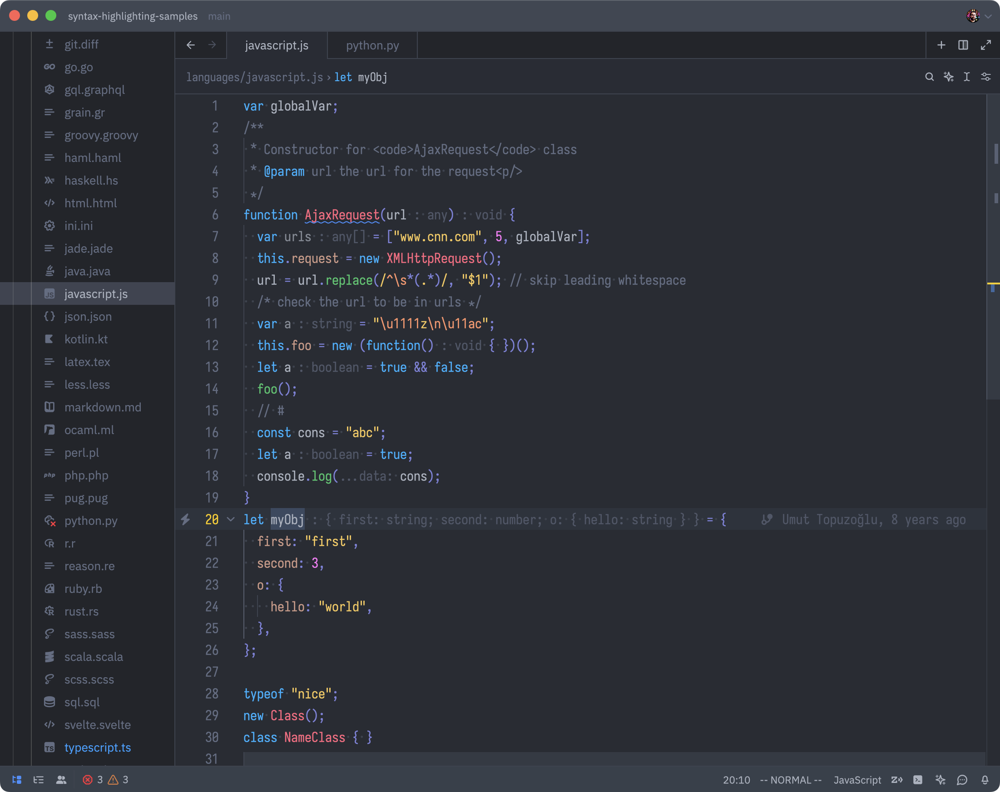
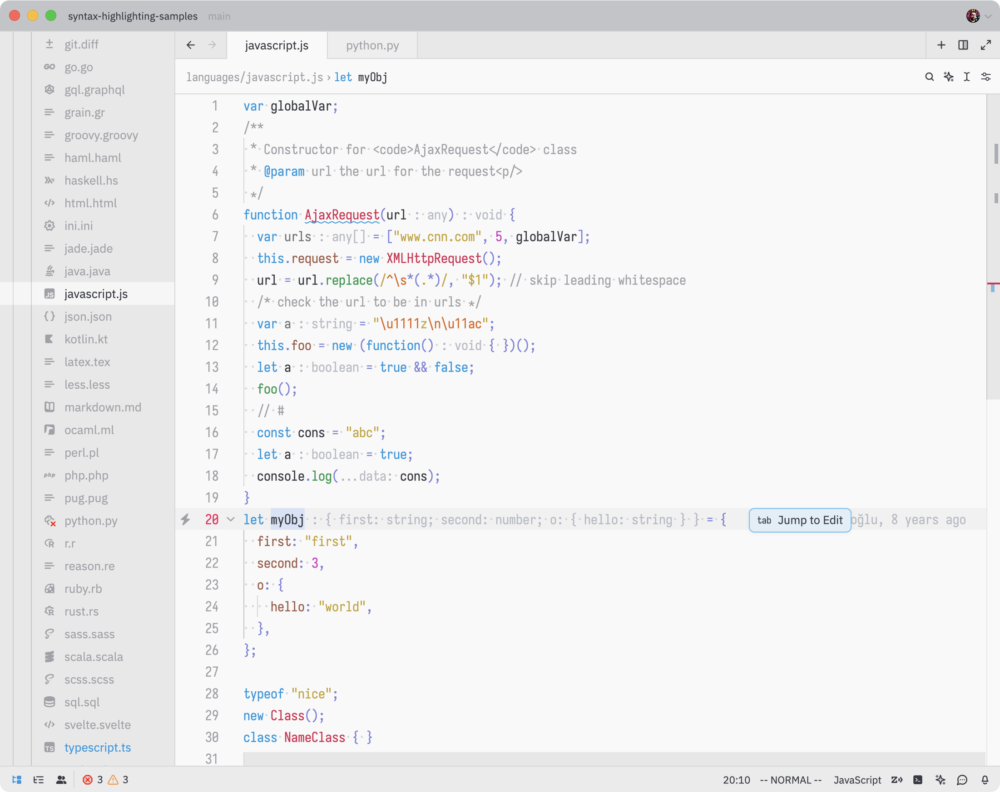

# Bluloco Theme for Zed Editor

A fancy and sophisticated designer theme for the zed editor.
It features a much more comprehensive usage of syntax scopes and color
consistency, with due regards to aesthetics, contrast and readability.
There is a light and dark variant.

This theme also works very good with blue light filters like Apple's _Nightshift Mode_ or _f.lux_.

This is a port of the popular Visual Studio Code Themes
[Bluloco Light](https://github.com/uloco/theme-bluloco-light) and
[Bluloco Dark](https://github.com/uloco/theme-bluloco-dark)

### Support

If you like using this, please consider donating a little bit. It takes a lot of time to keep this updated with neovim and plugin updates.
I want to keep bluloco a great experience for everybody and your help would be immensely motivating to keep me doing this. :)

### Dark

### Light

## Contributing

I'd be more than happy for any bugs you find and add an [issue](https://github.com/bluloco/bluloco-zed/issues).
Pull requests are warmly welcome :)

